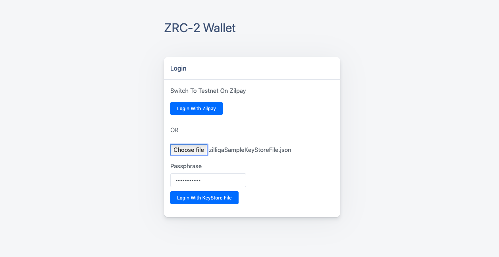

# zrc2-wallet-frontend

## About

This repo contains the front-end code for zrc2 wallet, which allows a user to store, send and receive zrc2 tokens on the Zilliqa developer testnet (https://dev-api.zilliqa.com/). Use this repo with [zrc2-wallet-backend](https://github.com/arnavvohra/zrc2-wallet-backend) to test the functionality of the zrc2 wallet.

## Setup

```
git clone https://github.com/arnavvohra/zrc2-wallet-frontend.git
cd zrc2-wallet-frontend
npm install
npm start
```
The system should have mongodb installed and running.
Make sure you have setup src/config file correctly to avoid any errors. By default the apiUrl is set to port 4111, if your zrc2-wallet backend server is running at some other port, update the value accordingly.

src/config.js
```
let config = {};
config.apiUrl = "http://localhost:4111";
module.exports = config;

```
## Sample Data
Sample Keystore File can be found at: 

src/zilliqaSampleKeyStoreFile.json

Passphrase : zilliqa@123

Add fungible token with the following address on Add Token Screen : zil1glvua6569k3rm34jm94pdalmlzz9spn965uudj
The above address obtained through the keystore file has a balance of the fungible token already.
## Screenshots

Login Screen - Keystore File already uploaded



Wallet Home Screen


Add Token Screen


Send Transaction Screen


# Additional Notes
The base code of zrc2-wallet-frontend is taken from a [template](https://github.com/DesignRevision/shards-dashboard-react).
The majority of the code of the wallet can be found in src/views and src/components/components-overview.
Refer to src/routes.js to follow along with the codebase.
